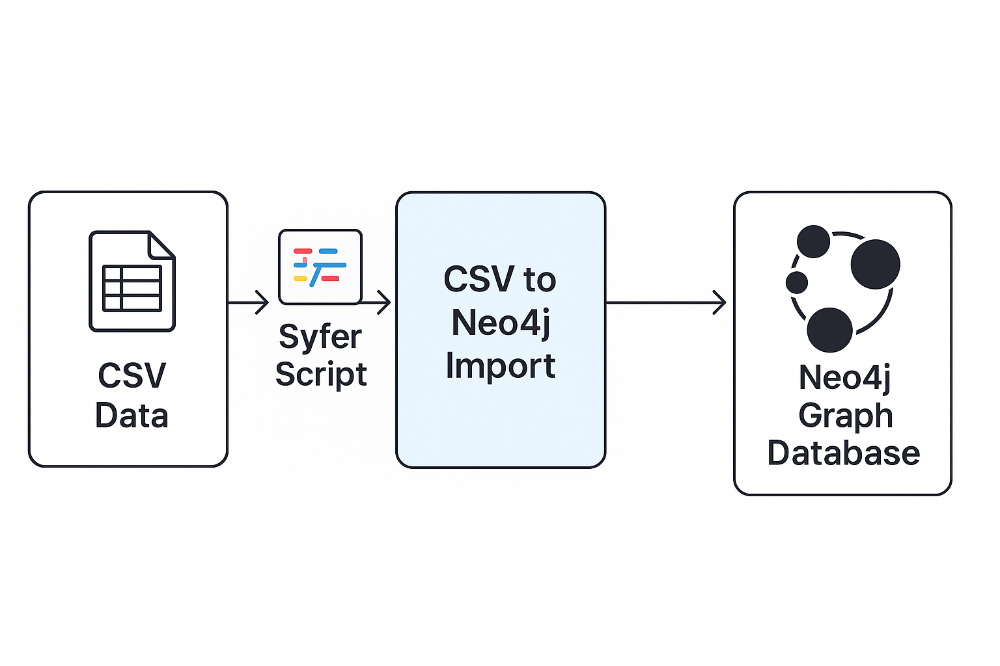

# knowledge-graph-RAG
# 📊 CSV to Neo4j Import using Syfer Language

A flexible tool to transform structured **CSV** data into a **Neo4j graph database** using the custom-built **Syfer** domain-specific language (DSL). Designed for rapid knowledge graph construction and semantic relationships.



---

## 🔧 Features

- ✅ Parse CSV files into structured node/relationship definitions.
- ✅ Use the **Syfer DSL** to define how CSV data maps to the graph.
- ✅ Automatically generate and execute Cypher queries.
- ✅ Supports batch imports for large datasets.
- ✅ Works with Neo4j Desktop, AuraDB, or Docker Neo4j instances.

---

## 🧠 What is Syfer?

**Syfer** is a mini-DSL (Domain-Specific Language) designed to describe how CSV columns should be transformed into Neo4j nodes and relationships.

Example Syfer Script:

```syfer
DEFINE NODE Person
  FROM COLUMN name, age
  SET label = "Person";

DEFINE RELATIONSHIP WORKS_AT
  FROM COLUMN company
  TO NODE Company
  SET type = "WORKS_AT";
